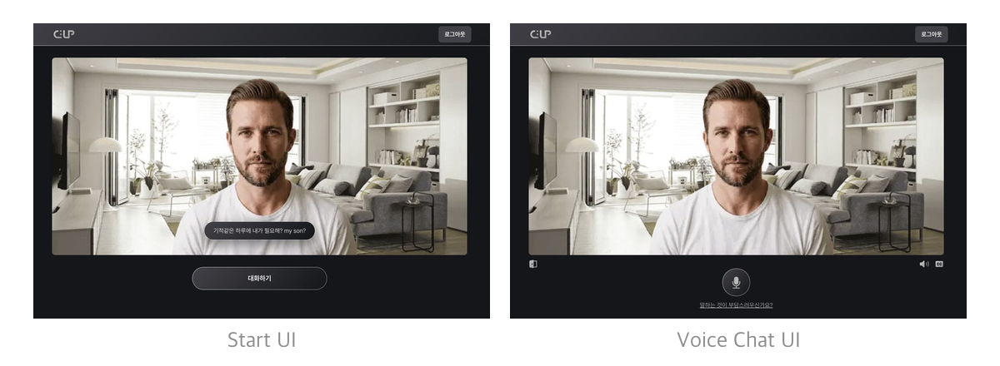
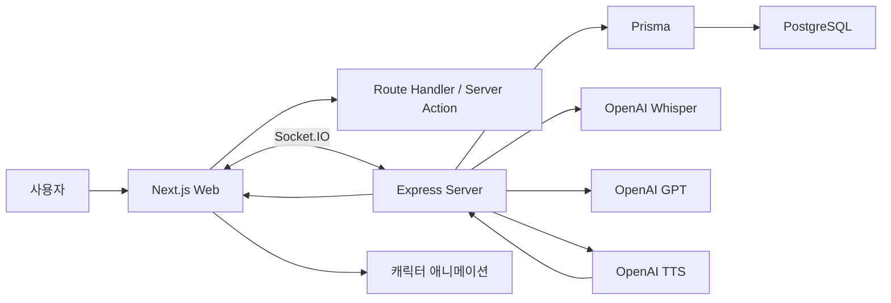

# C-UP

> 감정을 솔직하게 표현하기 어려운 사용자를 위한 AI 음성 대화 서비스

  <strong>2026.03. ~ 2026.06.</strong>

  

## 개요

- C-UP은 솔직한 감정 표현이 어려운 사용자가 AI 캐릭터와 음성으로 대화하며 생각을 정리할 수 있도록 만든 서비스입니다.
- 사용자의 음성을 텍스트로 변환하고, 최근 대화 맥락을 기반으로 AI 응답을 생성한 뒤 TTS와 캐릭터 애니메이션으로 실시간 대화 경험을 제공합니다.
- Web, Server, DB 설계, OpenAI 연동, 배포까지 1인 개발로 진행했습니다.

---

## 참여 인원

- **Web · Server 개발자 1명(본인)**

---

## 기술 스택

### Frontend

### Backend

### Deploy / Infra

---

## 주요 기능

- **인증 기능**: 회원가입, 로그인, 로그아웃, Access Token 재발급
- **음성 대화**: MediaRecorder로 사용자 음성을 chunk 단위로 전송하고 Socket.IO로 실시간 처리
- **AI 응답 스트리밍**: OpenAI 응답을 텍스트 chunk와 음성 chunk로 나누어 클라이언트에 전달
- **STT/TTS 연동**: Whisper로 사용자 음성을 텍스트화하고, TTS로 캐릭터 음성을 생성
- **감정 기반 캐릭터 애니메이션**: 사용자 발화의 감정 점수를 기반으로 캐릭터 상태 전환
- **입모양 싱크**: TTS 텍스트의 글자/모음과 duration 정보를 활용해 입모양 애니메이션 동기화
- **대화 맥락 저장**: 최근 메시지를 DB에 저장하고 다음 AI 응답의 문맥으로 재사용

---

## 주요 업무

| 구분 | 내용 |
| --- | --- |
| 기획 | 문제 정의, 사용자 분석, 기능 명세서/API 명세서 작성 |
| 프론트엔드 | Next.js App Router 기반 구조 설계, 인증 페이지, 대화 UI, 공통 컴포넌트 구현 |
| 실시간 통신 | Socket.IO 기반 음성 chunk 송수신, AI 텍스트/음성 스트리밍 처리 |
| 백엔드 | Express.js 기반 REST API, JWT 인증, Room/Message 도메인 구현 |
| AI 연동 | Whisper STT, GPT 응답 생성, TTS 음성 생성 및 스트리밍 |
| 캐릭터 애니메이션 | 감정별 프레임 구성, 모음 기반 입모양, 인비트위닝 적용 |
| 배포/운영 | Vercel, AWS EC2/RDS, Docker 기반 배포 구조 구성 |

---

## 서비스 아키텍처

1. 사용자가 웹에서 로그인 후 Room에 입장합니다.
2. 음성 입력은 브라우저에서 chunk로 분할되어 Socket.IO로 서버에 전달됩니다.
3. 서버는 chunk를 병합하고 Whisper로 텍스트를 추출합니다.
4. 서버는 최근 메시지와 캐릭터 프롬프트를 포함해 GPT 응답을 스트리밍합니다.
5. 응답 텍스트를 TTS로 변환하고, estimated alignment를 함께 내려줍니다.
6. 클라이언트는 텍스트, 음성, 입모양 애니메이션을 동기화해 출력합니다.

---

## 개발 과정

| 기간 | 주요 작업 |
| --- | --- |
| 1~2주차 | 기획 문서 작성, 기능/API 명세, DB/ERD 설계 |
| 3~5주차 | Node.js 서버 구축, 인증 API, Socket.IO, STT/GPT 연동 |
| 6주차 | 서버 성능 개선, 프롬프트 최적화, AWS/Docker 배포 구성 |
| 7~9주차 | Next.js 웹 구조, 인증 UI, 채팅방, 소켓 통신 연동 |
| 10주차 | Vercel 배포, 캐싱/페이지 전환/체감 속도 테스트 |
| 11~12주차 | 캐릭터 애니메이션 고도화, 입모양 싱크, 발표/사용 설명 자료 준비 |

---

## 문제 해결

| 문제 | 원인 | 해결 |
| --- | --- | --- |
| 입모양이 어색함 | 단순 프레임 전환만으로는 실제 발화 느낌이 부족함 | 글자의 모음 기준으로 mouth shape를 분리하고 TTS alignment에 맞춰 전환 |
| 음성과 애니메이션 싱크 불일치 | TTS 음성 재생 시간과 화면 전환 타이밍이 분리됨 | 응답 텍스트별 estimated duration을 생성해 클라이언트에서 viseme timing으로 사용 |
| 응답 체감 시간이 김 | 전체 응답 완료 후 출력하면 대화감이 떨어짐 | 텍스트 chunk, 음성 chunk를 나누어 스트리밍하고 먼저 도착한 응답부터 표시 |
| 서버 스택 변경 필요 | 초기 Spring Boot 계획은 실시간 스트리밍 실험 속도에 부담 | Node.js/Express.js와 Socket.IO 중심 구조로 변경 |

---

## 배운점

- **음성 전송 최적화**
  - 긴 음성을 일괄 전송할 경우 업로드 시간이 길어져 응답 대기 시간이 증가한다고 판단했습니다.
  - Socket.IO를 활용해 음성 데이터를 3~5초 단위의 chunk로 분할해 순차적으로 전송하고, 종료 요청 이후 서버에서 데이터를 병합하도록 구조를 변경하여 기존 대비 응답 시간을 약 97% 단축했습니다.
- **감정 분석 최적화**
  - 서비스에서 필요한 감정이 `기쁨`과 `슬픔` 두 가지뿐이라는 점에 주목했습니다.
  - LLM 기반 감정 분석 대신 STT로 변환한 텍스트에서 슬픔을 나타내는 키워드를 판별하는 방식으로 변경하여 처리 시간을 약 50% 단축하고 API 비용을 절감했습니다.
- 실시간 스트리밍은 실제 처리 시간뿐 아니라 사용자가 느끼는 응답 흐름이 중요하다는 점을 배웠습니다.
- STT, GPT, TTS가 연결된 AI 서비스에서는 각 단계의 지연을 분리해서 줄여야 한다는 점을 경험했습니다.
- 캐릭터 애니메이션은 이미지 생성보다 재생 타이밍과 전환 방식이 사용자 경험에 더 크게 작용한다는 점을 알게 되었습니다.
- 계획한 기술 스택을 고집하기보다 서비스 특성에 맞게 Node.js/Express.js 구조로 전환하는 의사결정을 경험했습니다.
